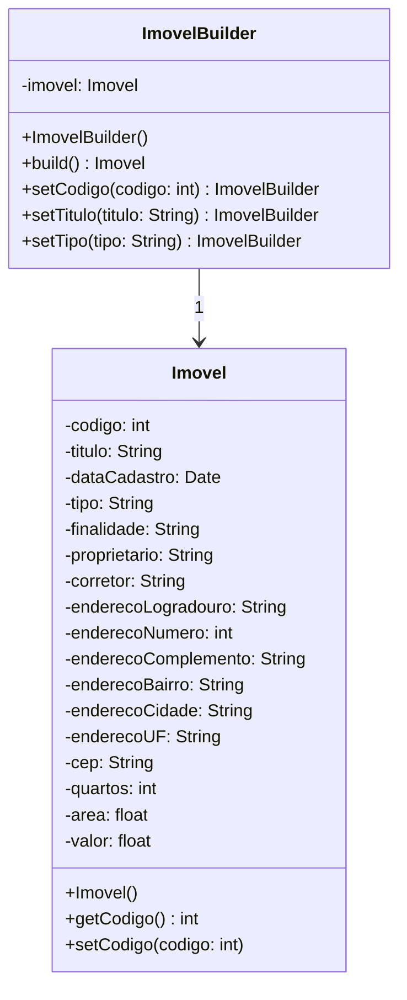

# Diagrama UML — Builder (Imóvel para Anúncio)

```mermaid
classDiagram
    class ImovelBuilder {
        -imovel: Imovel
        +ImovelBuilder()
        +build() Imovel
        +setCodigo(codigo: int) ImovelBuilder
        +setTitulo(titulo: String) ImovelBuilder
        +setTipo(tipo: String) ImovelBuilder
    }

    class Imovel {
        -codigo: int
        -titulo: String
        -dataCadastro: Date
        -tipo: String
        -finalidade: String
        -proprietario: String
        -corretor: String
        -enderecoLogradouro: String
        -enderecoNumero: int
        -enderecoComplemento: String
        -enderecoBairro: String
        -enderecoCidade: String
        -enderecoUF: String
        -cep: String
        -quartos: int
        -area: float
        -valor: float
        +Imovel()
        +getCodigo() int
        +setCodigo(codigo: int)
    }

    ImovelBuilder --> Imovel : 1
```
